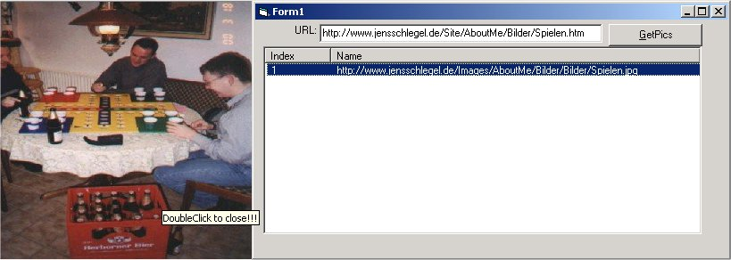



## GetPics

### Description

GetPics searches a specified WebSite für Pictures.

The HTML-Source of a Site is parsed for the "img src" - Tag, relative Links will be converted into absolute Links and all available pictures are show in a ListVew. DoubleClick on an entry to get the complete Picture temporarily onto your HD and view it in a Image-Control. DoubleClick the control to delete the Image.
 
### More Info
 
Any URL

The Pictures of the URL

No Error-Handling inluded!

             |
---                |---
**Submitted On**   |2001-01-13 12:41:26
**By**             |[N/A](https://github.com/Planet-Source-Code/PSCIndex/blob/master/ByAuthor/empty.md)
**Level**          |Intermediate
**User Rating**    |4.3 (17 globes from 4 users)
**Compatibility**  |VB 5\.0, VB 6\.0
**Category**       |[Internet/ HTML](https://github.com/Planet-Source-Code/PSCIndex/blob/master/ByCategory/internet-html__1-34.md)
**World**          |[Visual Basic](https://github.com/Planet-Source-Code/PSCIndex/blob/master/ByWorld/visual-basic.md)
**Archive File**   |[CODE\_UPLOAD137321132001\.zip](https://github.com/Planet-Source-Code/getpics__1-14394/archive/master.zip)

